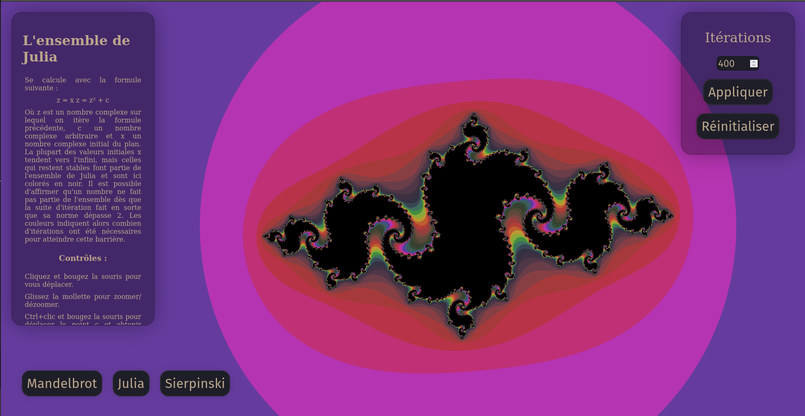

# Fractales
Ceci est ma soumissions au défis de Mars du REI.

Explorez l'ensemble de Mandelbrot, l'ensemble de Julia et le triangle de Sierpinski à l'aide de la puissance de votre GPU, sur le web!

# Build
Vous aurez besoin d'un serveur web. Les fichiers nuanceurs (shaders) ne sont pas incluts dans le code javascript et il doit aller les chercher
de manière asynchrone. À cause de la politique "Same Origin", cette requête HTTP ne peut se faire localement.

Autrement, vous pouvez toujours visiter [ici](https://gyoo18.github.io/Mandelbrot/).

# Fonctionnement
Cette démo fait usage de WebGL2. L'écran est en réalité un canvas WebGL. La page d'acceuil est composée d'un nuanceur qui affiche une couleur uniforme et le changement de fractale est essentiellement un changement de nuanceur. Celui-ci se fait quasi-instantannément, car tout les nuanceurs sont chargés et compilé au chargement de la page.

## Mandelbrot et Julia
Ces deux ensembles sont assez similaires. Leurs équation vas comme suit : 

z = z² + c

Dans le cas de l'ensemble de Mandelbrot, le c se trouve à être la coordonnée du plan complexe, tandis que dans le cas de Julia, le c est une constante et c'est le z est initialisé à la coordonnée du plan complexe. Dans les deux cas, la valeur du z est modifiée par itération. La plupart des valeurs du plan tendent vers l'infini mais certaines sont stables et font alors partie de l'ensemble. Ces valeurs sont alors colorées en noir à l'écran. Les valeurs qui tendent vers l'infini se distiguent par le fait qu'elles atteignent une norme plus grande que 2. On peut alors itérer la formule jusqu'à atteindre la distance critique et colorier la position originale en fonction du nombre d'itération prises.

## Sierpenski
C'est une fractale qui semble triviale de prime abords, car sa construction classique est bien simple : découpez un triangle inversé de chaque triangle plein et continuez récursivement. Cependant, cette approche ne se prête pas à la construction par GPU, en effet il nous faut un protocole pour partir d'un point sur le plan et déterminer s'il est à l'intérieur du triangle. C'est pourquoi j'ai opté pour une autre approche dont je me suis inspiré de chez [Code Parade](https://www.youtube.com/watch?v=svLzmFuSBhk). L'idée est la suivante : construisez un triangle et copiez-le en réfléchissant le plan autour d'un axe. La solution finale est moins triviale qu'il n'y parraît, car une réflexion ne peut pas se faire dans une zone réfléchie, mais la base s'y trouve. Cette approche a l'avantage de fournir facilement la distance depuis les bords du triangle, ce qui offre une jolie vue.

## Remerciements
Merci à :
- [Code Parade](https://www.youtube.com/watch?v=svLzmFuSBhk) pour l'inspiration pour la construction du triangle de sierpenski
- [Sam Hocevar](https://stackoverflow.com/questions/15095909/from-rgb-to-hsv-in-opengl-glsl) pour l'algorithme de convertion d'espace de couleur rgb à hsv et inverse. La solution n'est pas la sienne, mais le [le lien qu'il fournit](http://lolengine.net/blog/2013/07/27/rgb-to-hsv-in-glsl.) ne semble pas fonctionner